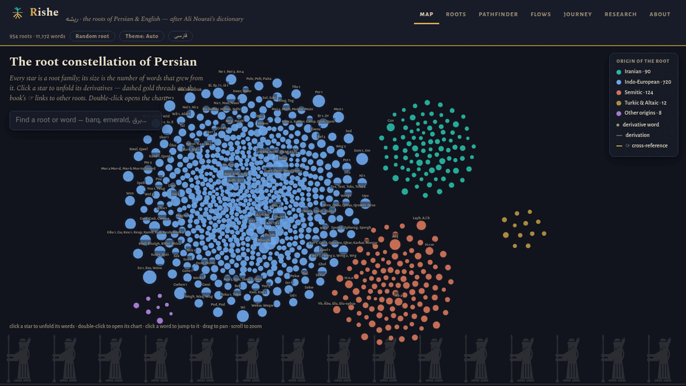
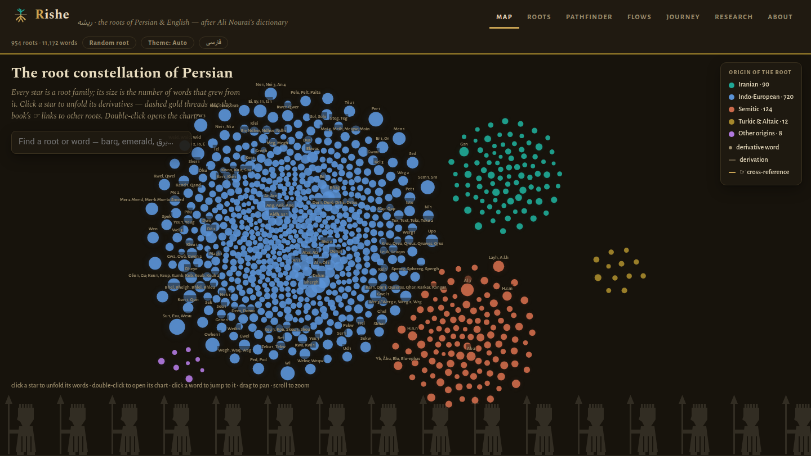
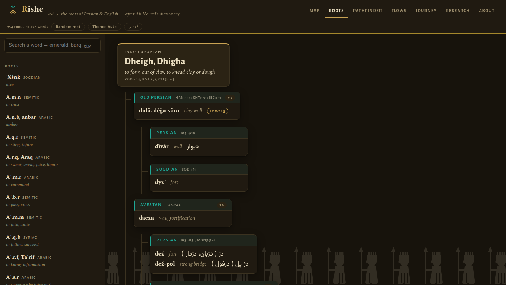
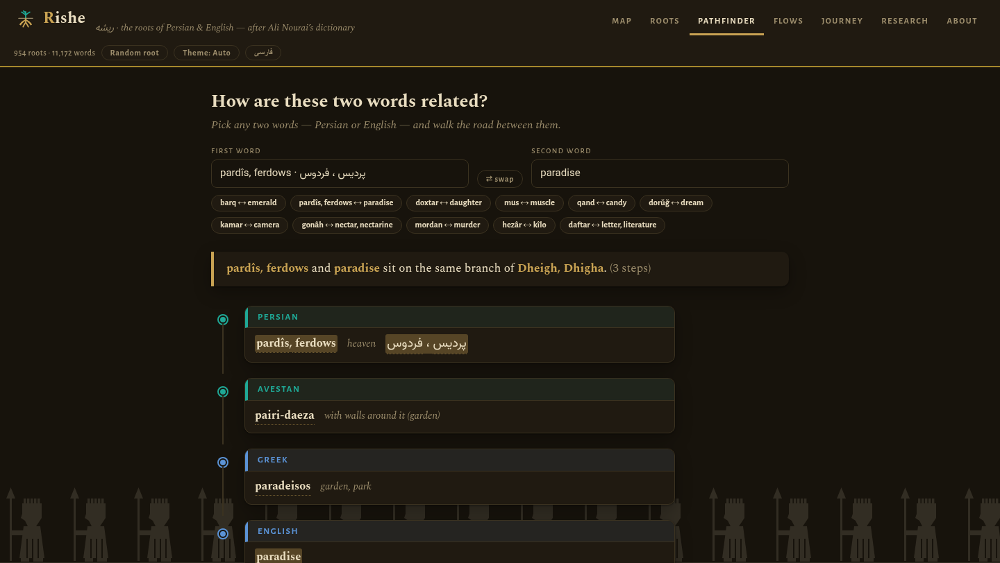
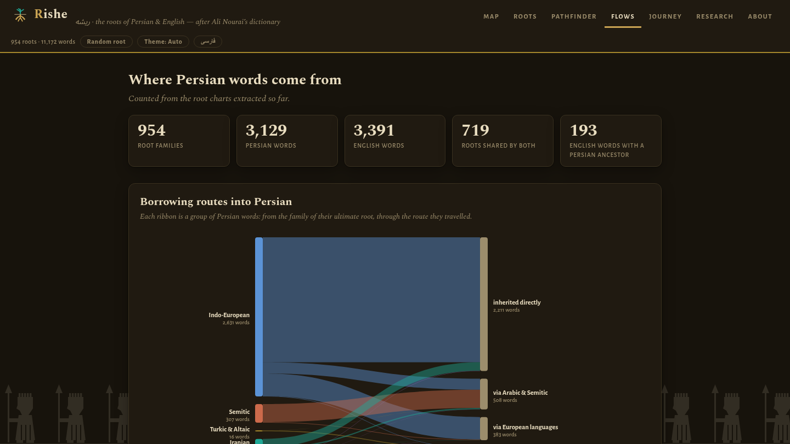
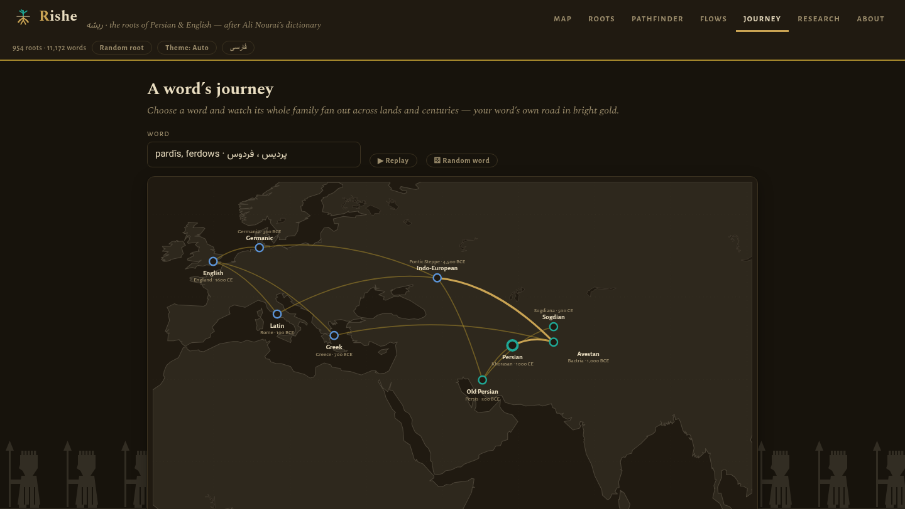
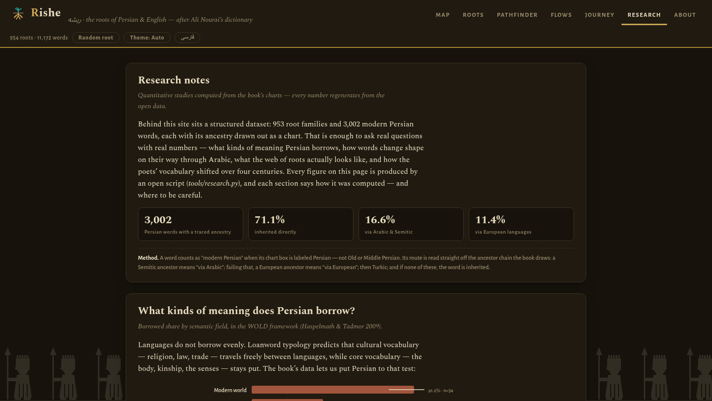
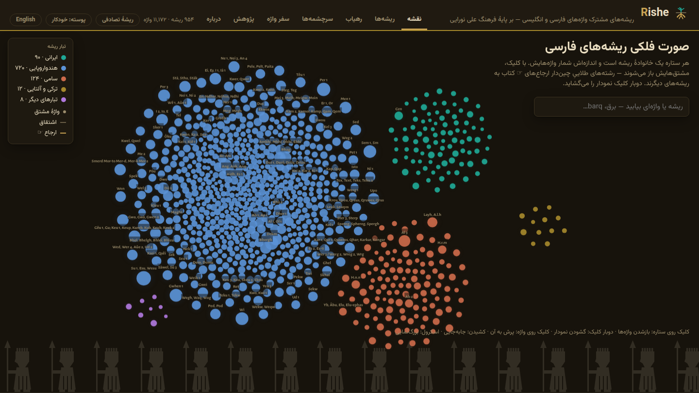

<div align="center">

# ریشه · Rishe

**ریشه‌های مشترک فارسی و انگلیسی، گسترده چون آسمان شب.**

[**سایت زنده**](https://sfmqrb.github.io/rishe/?lang=fa) · [**English README**](README.md)

<a href="https://sfmqrb.github.io/rishe/?lang=fa"></a>

</div>

<div dir="rtl">

**ریشه** بازآفرینی تعاملی کتاب **علی نورائی** است —
*فرهنگ ریشه‌شناختی فارسی، انگلیسی و دیگر زبان‌های هندواروپایی* —
مرجعی کم‌نظیر که بیش از ۱٬۶۰۰ ریشهٔ مشترک نزدیک به ۴٬۷۰۰ واژهٔ فارسی و
۳٬۳۰۰ واژهٔ انگلیسی را ترسیم کرده است. از این کتاب تنها یک نسخهٔ اسکن‌شده با
نمودارهای دست‌کشیده در دست بود؛ این پروژه هر ۵۴۱ نمودار آن را به دادهٔ
ساخت‌یافته و باز تبدیل کرده و بر پایهٔ آن وب‌سایتی دوزبانه ساخته است:
صورت فلکی‌ای از همهٔ خانواده‌های ریشه که می‌توان در آن جست‌وجو و پرواز کرد،
نمودارهای کتاب به شکل درخت‌های تعاملی با شاهدهای شعری زیر همان واژه‌هایی که
گواهی می‌دهند، رهیابی که راه میان هر دو واژه را می‌پیماید
(*شاه* ↔ *checkmate*، *پردیس* ↔ *paradise*)، و نقشه‌ای جان‌دار از سفر
خانوادهٔ هر واژه در سرزمین‌ها و سده‌ها.

این داده‌ها به کاری بیش از تماشا آمدند. بخش «پژوهش» مطالعه‌هایی کمّی را
یک‌راست از دل نمودارها می‌سازد — نرخ وام‌گیری به تفکیک حوزهٔ معنایی،
قانون‌های آوایی وام‌گیریِ دوباره از راه عربی که از دوقلوهای واژگانی بازیابی
شده، و شیب سره‌گرایی شاعران از رودکی تا حافظ — و سپس فرهنگ را با ۸٫۵ میلیون
واژه از شعر فارسیِ پیکرهٔ [گنجور](https://ganjoor.net) می‌آمیزد تا همان
یافته‌ها را روی دیوان کامل ۵۶ شاعر در گسترهٔ هزار سال بیازماید. همهٔ اعداد با
اسکریپت‌های باز همین مخزن بازتولید می‌شوند، و کل سایت یک فایل HTML خودبسنده
است: بدون بک‌اند، بدون فریم‌ورک، بدون کتابخانهٔ بیرونی — و آفلاین هم کار می‌کند.

## نمایش

</div>

| | |
|---|---|
| [](https://sfmqrb.github.io/rishe/?lang=fa#map) **نقشه** — هر خانوادهٔ ریشه یک ستاره، خوشه‌بندی‌شده بر پایهٔ تبار | [](https://sfmqrb.github.io/rishe/?lang=fa#roots) **ریشه‌ها** — نمودارهای کتاب به شکل درخت‌های تعاملی دوزبانه |
| [](https://sfmqrb.github.io/rishe/?lang=fa#path) **رهیاب** — *پردیس* ← *pairi-daêza* ← *paradeisos* ← *paradise* | [](https://sfmqrb.github.io/rishe/?lang=fa#flows) **سرچشمه‌ها** — واژه‌ها از کدام راه به فارسی آمده‌اند |
| [](https://sfmqrb.github.io/rishe/?lang=fa#journey) **سفر واژه** — پراکندن خانوادهٔ یک واژه روی نقشه‌ای کهن | [](https://sfmqrb.github.io/rishe/?lang=fa#research) **پژوهش** — مطالعه‌های کمّی با روشِ گفته‌شده |

<div dir="rtl">

سراسر سایت دوزبانه است — دکمهٔ «فارسی» در سربرگ (یا
[`?lang=fa`](https://sfmqrb.github.io/rishe/?lang=fa)) همهٔ برچسب‌ها،
شرح‌های نمودار و یادداشت‌ها را فارسی می‌کند و کل چیدمان را راست‌به‌چپ
برمی‌گرداند:

</div>

<div align="center">
<a href="https://sfmqrb.github.io/rishe/?lang=fa"></a>
</div>

<div dir="rtl">

## چه چیزهایی درون آن است

- **English / فارسی** — نزدیک به ۷٬۱۰۰ شرح و یادداشت انگلیسیِ کتاب به فارسی
  برگردانده شده (`data/translations/fa.json`) و در همان تک‌فایل جای گرفته است؛
  چیدمان، آینه‌وار راست‌به‌چپ می‌شود.
- **نقشه** — هر خانوادهٔ ریشه ستاره‌ای است در صورتی فلکی و بزرگ‌نمایی‌پذیر؛
  خوشه‌بندی بر پایهٔ تبار (هندواروپایی، سامی، ایرانی، ترکی) و اندازهٔ هر ستاره
  به شمار واژه‌های برآمده از آن. با بردن نشانگر روی هر ریشه، همسایه‌های
  ارجاع‌شده‌اش روشن می‌شوند.
- **ریشه‌ها** — نمودارهای کتاب به شکل درخت‌های تعاملی: جست‌وجوی دوزبانه
  (برق یا *barq* یا *emerald*)، شاخه‌های بازوبسته‌شونده، شاهدهای شعری
  (فردوسی، حافظ، سعدی…) زیر همان واژه‌ها، و دکمهٔ «صفحهٔ اسکن‌شده» برای دیدن
  صفحهٔ اصلی کتاب.
- **رهیاب** — دو واژه برگزینید و راه میانشان را بپیمایید. خویشاوندی یعنی
  ریشهٔ به‌راستی مشترک؛ یادداشت‌های حاشیه‌ای ☞ کتاب جداگانه و صادقانه نمایش
  داده می‌شوند.
- **سرچشمه‌ها** — نمودار سانکیِ راه‌های ورود واژه‌ها به فارسی: میراث مستقیم،
  از راه عربی، از راه زبان‌های اروپایی، از راه ترکی — همراه با اعداد سرخط
  (۷۱۹ ریشهٔ مشترک میان فارسی و انگلیسی، و در حال افزایش).
- **سفر واژه** — نقشه‌ای کهن و جان‌دار از پراکندن خانوادهٔ یک واژه در
  سرزمین‌ها و سده‌ها؛ راهِ واژهٔ شما به رنگ زر.
- **پژوهش** — مطالعه‌های کمّیِ برآمده از نمودارها، با روشِ گفته‌شده در همان
  صفحه: نرخ وام‌گیری به تفکیک حوزهٔ معنایی WOLD (با برچسب‌گذاری دوباره)،
  قانون‌های آوایی وام‌گیریِ دوباره از راه عربی، واژه‌های رفت‌وبرگشتی، شیب
  سره‌گرایی شاعران (رودکی ← حافظ)، توپولوژی شبکهٔ ارجاع‌های ☞، «نُه درجهٔ
  ریشه‌شناسی»، و این‌که شباهت ظاهری چه گمراه‌کننده پیش‌بینی‌گرِ خویشاوندی
  واقعی است (دوستان دروغین هم هستند). همهٔ اعداد با `tools/research.py`
  بازتولید می‌شوند.
- **مطالعه‌های پیکرهٔ گنجور** — آمیختن فرهنگ با ۸٫۵ میلیون واژه از شعر فارسیِ
  پایگاه رسمی [گنجور](https://ganjoor.net): آزمودن دوبارهٔ شیب سره‌گرایی روی
  دیوان کامل ۵۶ شاعر (فردوسی ← سیمین بهبهانی، ۹۰۰–۱۹۷۵ میلادی)، تاریخ نخستین
  گواهی برای هر واژهٔ نمودارشده (لایهٔ یونانی در برابر موج اروپایی مدرن)، و
  سنجش گونه‌ها در برابر رخدادها — تنها حدود ۴٪ از متن جاری شعر وام‌واژه است،
  هرچند حدود ۲۸٪ از واژگانِ نمودارشده وامی‌اند. بازتولید با `tools/ganjoor.py`.

## سرچشمه و سپاس

همهٔ دانشوری این کار از آنِ **علی نورائی** است. کتاب به‌رایگان در
[Internet Archive](https://archive.org/details/AnEtymologicalDictionaryOfPersianEnglishAndOtherIndo-europeanLanguages)
در دسترس است. این پروژه ادای احترامی غیرتجاری است؛ حقوق محتوای فرهنگ نزد
مؤلف آن باقی است.

## داده‌ها چگونه ساخته شدند

اسکن کتاب متن دیجیتال ندارد و OCR معمولی نمودارها را نابود می‌کند. استخراج را
ناوگانی از عامل‌های بیناییِ **Claude** (شرکت Anthropic) صفحه‌به‌صفحه انجام
دادند: هر صفحهٔ نمودار با وضوح ۲۰۰ DPI رندر شد، هر جعبه خوانده شد و خط
فارسی‌عربی حرف‌به‌حرف از برش‌های بزرگ‌نمایی‌شده رونویسی شد، پیکان‌های
دست‌کشیده برای بازسازی درختِ اشتقاق دنبال شدند، و نتیجه‌ها از نظر ساختاری
اعتبارسنجی شدند (`tools/validate.py`) — و نویسه‌های موردِ تردید با بیت‌های
کهنی که کتاب نقل می‌کند دوباره خوانده شدند. جزئیات و نقص‌های شناخته‌شدهٔ
منبع در [`data/ANOMALIES.md`](data/ANOMALIES.md) آمده است (از جمله: صفحهٔ ۹۲
کتاب در خودِ اسکن موجود نیست).

## چیدمان مخزن

</div>

```
data/EXTRACTION_SPEC.md      # طرح‌واره و قاعده‌هایی که عامل‌های استخراج پی گرفتند
data/extracted/batch/        # یک JSON برای هر صفحهٔ کتاب — فرهنگِ ساخت‌یافته
data/translations/fa.json    # برگردان فارسی شرح‌ها و یادداشت‌ها
data/research/               # تحلیل‌های پژوهشی (research.json) + برچسب حوزه‌های معنایی
data/ANOMALIES.md            # نقص‌های اسکنِ منبع
tools/research.py            # همهٔ اعداد برگهٔ «پژوهش» را می‌سازد
tools/ganjoor.py             # تحلیل‌های پیکرهٔ گنجور (data/research/ganjoor.json)
site/template.html           # کل اپ (HTML+CSS+JS؛ داده هنگام ساخت تزریق می‌شود)
site/pages/                  # اسکن فشردهٔ همهٔ صفحه‌های نمودار
tools/build_site.py          # داده + قالب ← site/risheh.html
tools/validate.py            # اعتبارسنجی ساختاری JSONهای استخراج‌شده
.github/workflows/pages.yml  # با هر push می‌سازد و روی GitHub Pages می‌فرستد
```

<div dir="rtl">

## اجرای محلی

</div>

```sh
python3 tools/build_site.py data/extracted/batch -o site/risheh.html
# سپس site/risheh.html را در مرورگر باز کنید — نیازی به سرور نیست
```

<div dir="rtl">

## خطایی دیدید؟

رونویسی‌ها از روی اسکن انجام شده و لغزش ممکن است. لطفاً
[یک ایشو باز کنید](https://github.com/sfmqrb/rishe/issues) — برای آنچه باید
بنویسید [CONTRIBUTING.md](CONTRIBUTING.md) را ببینید. دکمهٔ «صفحهٔ اسکن‌شده»
زیر هر نمودار، سنجیدن با نسخهٔ اصلی را آسان می‌کند.

</div>

---

<div align="center">

ساختهٔ <a href="https://www.cs.toronto.edu/~smaghrebi/" dir="ltr">Sajad F. Maghrebi</a> — چون
«فارسی شکر است».

</div>
