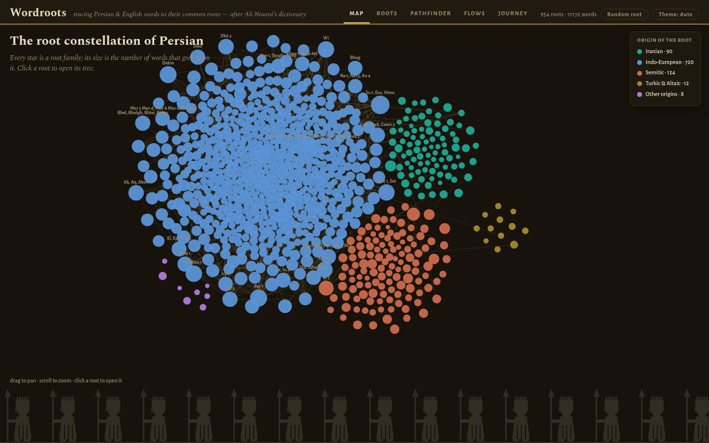

# Rishe · ریشه

**The roots of Persian & English, laid out like a night sky.**

**Live site → https://sfmqrb.github.io/wordroot/**



*Rishe* (ریشه, Persian for *root*) is an interactive rendition of **Ali Nourai's**
*An Etymological Dictionary of Persian, English and other Indo-European Languages* —
a remarkable reference charting over 1,600 shared roots of some 4,700 Persian and
3,300 English words. The book exists only as a scan; this project turned all 541 of
its hand-drawn derivation charts into structured data and a website.

## What's inside

- **Map** — every root family as a star in a zoomable constellation, clustered by
  origin (Indo-European, Semitic, Iranian, Turkic), sized by its descendants.
  Hover a root to light up its cross-referenced neighbors.
- **Roots** — the book's charts as interactive trees: bilingual search
  (برق or *barq* or *emerald*), collapsible branches, the poetry citations
  (Ferdowsî, Hâfez, Sa'dî…) under the words they attest, and a
  *View scanned page* button showing the original printed page.
- **Pathfinder** — pick any two words and walk the road between them
  (*šâh* ↔ *checkmate*, *pardîs* ↔ *paradise*). Kinship means a genuinely
  shared root; the book's ☞ margin notes are shown separately and honestly.
- **Flows** — a Sankey of how words entered Persian: inherited directly,
  via Arabic, via European languages, via Turkic — plus headline numbers
  (492 roots shared by Persian and English, and counting).
- **Journey** — an animated old-map of a word's family fanning out across
  lands and centuries, your word's own road drawn in gold.

The site is a single self-contained HTML file — no backend, no build framework,
no external libraries. It works offline.

## Source & credit

All the scholarship belongs to **Ali Nourai**. The book is freely available at the
[Internet Archive](https://archive.org/details/AnEtymologicalDictionaryOfPersianEnglishAndOtherIndo-europeanLanguages).
This project is a non-commercial homage; rights to the dictionary's content remain
with its author.

## How the data was made

The scan has no digital text, and ordinary OCR destroys the charts. Extraction was
done by a fleet of **Claude** (Anthropic) vision-model agents working page by page:
each chart page rendered at 200 DPI, every box read with the Perso-Arabic script
transcribed character by character from magnified crops, the drawn arrows traced to
reconstruct each derivation tree, and the results validated structurally
(`tools/validate.py`) — with disputed glyphs re-read against the classical verses
the book quotes. Details and known source defects are in
[`data/ANOMALIES.md`](data/ANOMALIES.md) (notably: book page 92 is missing from the
scan itself).

## Repository layout

```
data/EXTRACTION_SPEC.md      # the schema & rules the extraction agents followed
data/extracted/batch/        # one JSON per book page — the structured dictionary
data/ANOMALIES.md            # source-scan defects
site/template.html           # the whole app (HTML+CSS+JS, data injected at build)
site/pages/                  # compressed scans of every chart page
tools/build_site.py          # data + template → site/risheh.html
tools/validate.py            # structural validation of the extracted JSON
.github/workflows/pages.yml  # builds & deploys to GitHub Pages on push
```

## Running locally

```sh
python3 tools/build_site.py data/extracted/batch -o site/risheh.html
# then open site/risheh.html in a browser — no server needed
```

## Found a mistake?

Transcriptions were made from a scan and slips are possible. Please
[open an issue](https://github.com/sfmqrb/wordroot/issues) — see
[CONTRIBUTING.md](CONTRIBUTING.md) for what to include. The *View scanned page*
button under every chart makes verifying against the original easy.

---

Built by [Sajad F. Maghrebi](https://www.cs.toronto.edu/~smaghrebi/) — because
Farsi is sugar. «فارسی شکر است»
